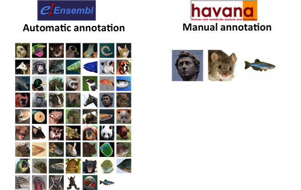
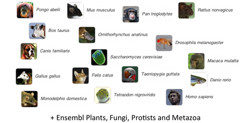
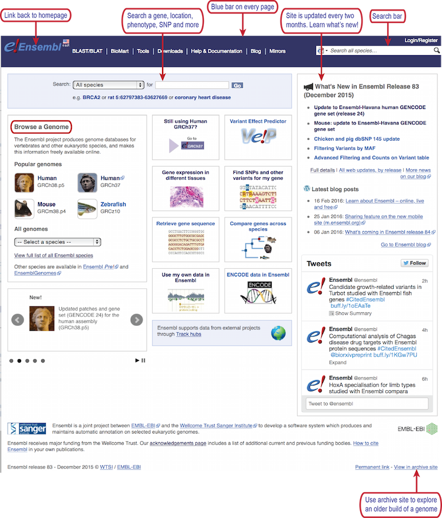
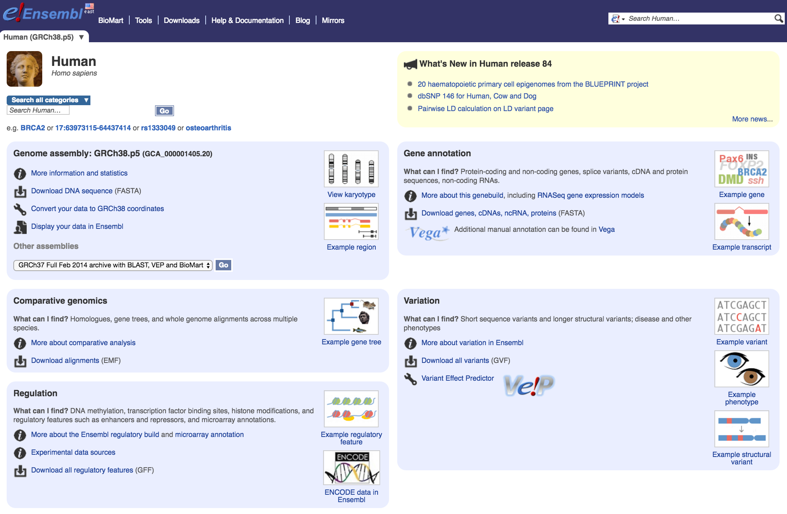
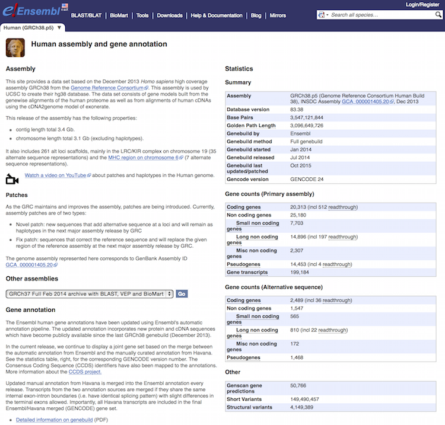
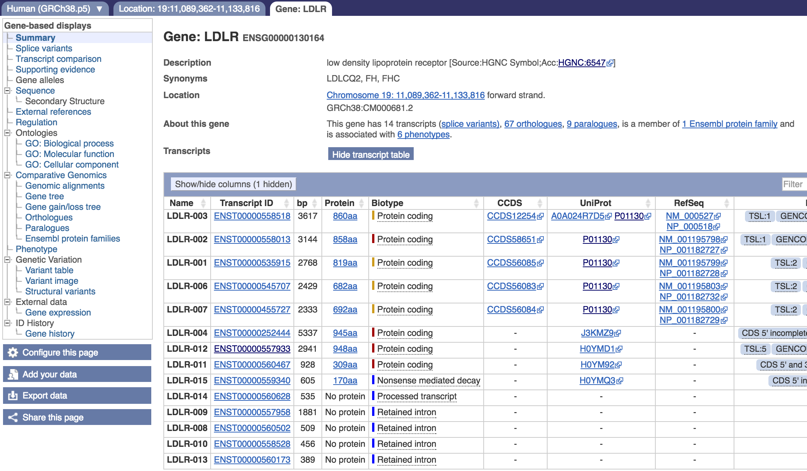
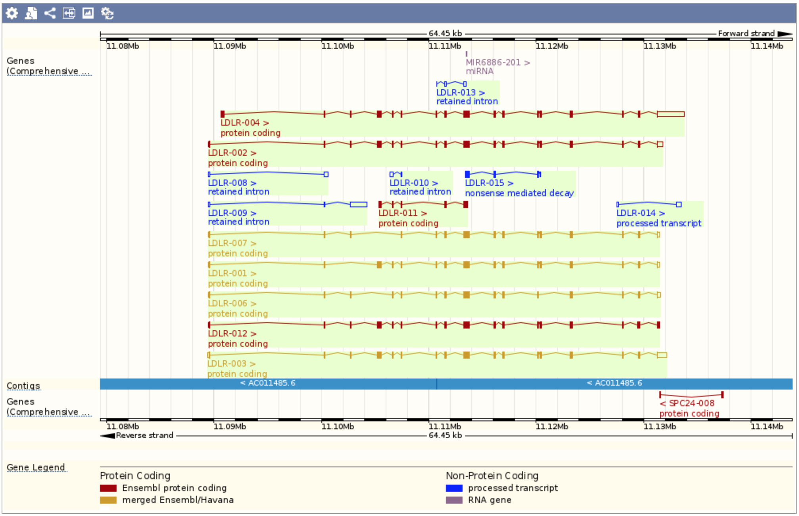
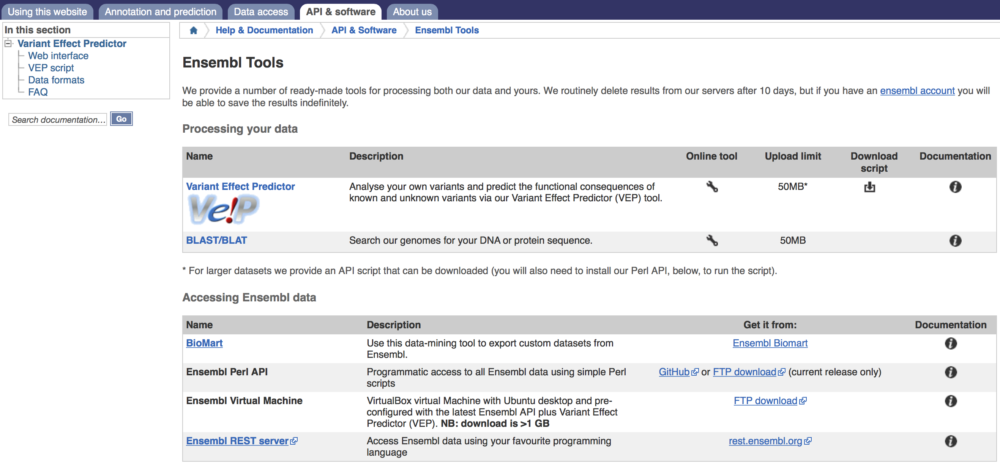
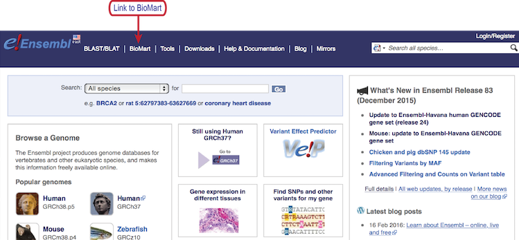
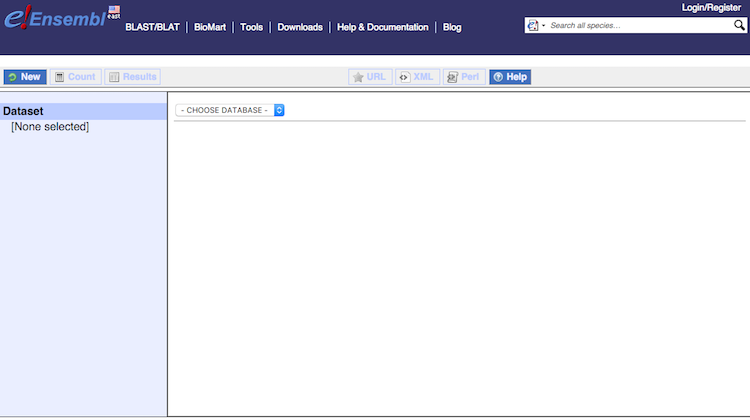

Approximate time: 45 minutes

## Learning Objectives

* learn how to use features of the Ensembl biological database to access information

## Intro to Ensembl/Biomart

### The Ensembl Project

The Ensembl genome annotation system, developed jointly by the EBI and the Wellcome Trust Sanger Institute, has been used for the annotation, analysis and display of vertebrate genomes since 2000. Ensembl is an excellent example of a secondary database that collects, curates and combines information for easy access to multiple databases in one place. All the Ensembl generated information is freely available to the scientific community and is updated regularly.

Since 2009, the [Ensembl](http://useast.ensembl.org/index.html) site has been complemented by the [Ensembl genomes](http://ensemblgenomes.org) sites for [bacteria](http://ensemblgenomes.org/info/genomes?division=1), [protists](http://ensemblgenomes.org/info/genomes?division=5), [fungi](http://ensemblgenomes.org/info/genomes?division=3), [plants](http://ensemblgenomes.org/info/genomes?division=4) and [invertebrate metazoa](http://ensemblgenomes.org/info/genomes?division=2), enabling users to use a single collection of interfaces for accessing and comparing genome-scale data from species across the taxonomy. _**NOTE:** no annotations available through Ensembl for viral genomes._

### Ensembl species and annotations
In the current release of the main Ensembl site (84), over 80 vertebrate species are supported, with over half of these species being mammals [[1](http://nar.oxfordjournals.org/content/early/2015/12/19/nar.gkv1157.full.pdf)]. The dataset also includes the invertebrates yeast, *C. elegans*, and fruitfly to aid in more accurate generation of phylogenetic gene trees. *(Current species statistics for the  non-vertebrate databases are also [available](http://nar.oxfordjournals.org/content/44/D1/D574.full)).*

**All supported species have comprehensive, evidence-based gene annotations.** The "Gencode gene set" is used to create the Ensembl annotations and is made up of:

- Ensembl (automatically) annotated genes (using mRNA and protein sequences from UniProtKB and NCBI RefSeq) 
- Havana (manually) annotated genes (human, mouse, zebrafish, rat and pig)
- Ensembl/Havana merges: transcripts that were identically annotated by both (reviewed annotations)

Gencode is the default gene set used by ENCODE, 1000 genomes and other major projects. 

A **selected set of genomes** includes additional data focused on *variation, comparative, evolutionary, functional and regulatory annotation*. The most advanced resources are provided for key species including **human, mouse, rat and zebrafish** reflecting the popularity and importance of these species in biomedical research.

### Ensembl genome browser

#### Overview
Ensembl provides a genome browser that acts as a **single point of access to annotated genomes** for vertebrate species. 

The browser can be used to easily access information at the genome, gene and protein level, such as gene sequence, splice variants, protein domains, genetic variation, homology, and regulatory elements. Ensembl imports genome sequences from consortia, which keeps the information consistent with many other bioinformatics projects. 

- **Searching Ensembl**:  Look for a gene, location, variant and more using the search box on the homepage or the box that is provided in the top right corner of any Ensembl page.

	- a gene name (for example, BRCA2) - best to use the official gene symbols ([HGNC](http://www.genenames.org))
	- a UniProt accession number (for example, P51587)
	- a disease name (for example, coronary heart disease)
	- a variation (for example, rs1223)
	- a location - a genomic region (for example, human 12:105000..200070)
	- a PDBe ID or a Gene Ontology (GO) term

	Most search results will take you to the appropriate Ensembl view through a results page. If you search using a location you will be directed straight to the location tab (this tab provides a view of a region of a genome).

- **Browse a Genome**: Choose your species of interest in this section. The drop down menu under 'All genomes' allows you to select from the full list. The *Ensembl Pre!* site contains new genomes (either new species to Ensembl, or updates in the reference assembly) that do not yet have an Ensembl gene set.  BLAST/BLAT is available for organisms in all Ensembl sites, including Pre!

- **Help**: There is a wealth of help and documentation in Ensembl if you are new to the browser. Video tutorials are provided, and printable pdfs with exercises. Custom data may be uploaded to Ensembl, or displayed directly by attaching a file by URL. 
	- **FTP site**: If you are looking to download the sequence for the reference genome or the gene annotation file for your organism of interest, the link is accessible from the `Help and Documentation` tab. If you want files for an older genome, then navigate to the archived sites and go to the `Help and Documentation` tab on these sites. The current release has files available at the following location: http://useast.ensembl.org/info/data/ftp/index.html.

- **News**: To find out what release you are working with, have a look at the news section of the homepage. If the current release is not the one you need, access archive sites to access previous versions, or releases, of Ensembl using the link on the lower right side.
 
#### Demo
Each species in Ensembl has its own home page, where you can find out who provided the genome sequence and which version of the genome assembly is represented.  

1. Click on `View full list of all Ensembl species` link. 
2. Click on the common name of your species of interest to go to the species homepage. We’ll click on `Human`.

	

	Within the human genome page, find the basic features:

	- Search bar for human information on gene, location, disease, etc.
	- News for the current human genome release
	- Information and sequences for the current human genome build
	- Links to example features in Ensembl
	- Guides on how to access information on comparative genomics, regulation, and variation
	
3. To find out more about genome assembly and the gene build, click on `More information and statistics`. Look over the information given in the statistics table.

	

4. Go back to the human genome page by clicking on the image. In the search bar type `ldlr`.
5. From the search results select `LDLR (Human Gene)`. The gene page for LDLR should populate. 
	
	
	
	The `Gene` page is organized as follows:
	
	- The top of the page has a **gene overview**, giving a gene description, synonyms, location, and number of transcripts. In addition, there are links to comparative analysis data and associated protein families and phenotypes.	
	- The overview is followed by the **transcript table**. All transcripts identified using any evidence are provided in the table. The transcripts are color-coded based on whether the transcript is protein-coding or non-coding, as well as, by the quality of evidence:
	
		- **Gold:** protein-coding transcripts are Ensembl/Havana merges - essentially reviewed annotations with highest confidence
		- **Red:** protein-coding transcripts with less confidence
		- **Blue:** non-coding transcripts
		
		In addition to coloring, Ensembl also provides flags in the table for **"Transcript Support Levels"**, which highlight how well-supported or poorly-supported are the transcript models.
		
		Also provided in the table are the links to the **Consensus CoDing Sequence** sets (CCDS) for available transcripts. The CCDS is a consensus set of coding sequences established as a collaborative effort between NCBI, Ensembl, Vega, UniProt-SwissProt, and UCSC. 
		
		Note the Ensembl ID for LLDR gene: ENSG00000130164. Ensembl uses the following format for naming:
	
		- ENSG###########	Ensembl Gene ID
		- ENST###########	Ensembl Transcript ID
		- ENSP###########	Ensembl Peptide ID
		- ENSE###########	Ensembl Exon ID
	
		For non-human species a suffix is added:
	
		- MUS (Mus musculus) for mouse ENSMUSG###
		- DAR (Danio rerio) for zebrafish: ENSDARG###
	

	- Below the transcript table is a summary section with links to other databases, followed by visualization of the transcripts.
	
	
	
	**NOTE:**, in the visualization, the blue bar represents the genome contig, and transcripts above the bar are forward-stranded and those below are reverse.
	
	- The side panel has **detailed gene information** displayed as a hierarchical tree. The various categories provide detailed and downloadable gene information, including associated sequence data, regulatory regions, GO terms, comparative genomics information, and variation data.
	
6. Let's suppose we are interested in the LDLR-002 transcript. Click on the LDLR-002 transcript ID, `ENST00000558013`. This should open a new tab entitled `Transcript: LDLR-002` with detailed information for the transcript. 

	- If you click on `exons`, the sequence for each of the exons will be displayed below. If you click on `91 domains and features` the associated domains are output. If you click on `2043 variations`, all variants for the transcript are listed with variation IDs, supporting evidence, and predicted effect on protein function. Additional detailed information on the transcript and protein is available on the side panel. 
	- Note that the menu on the left changed when you switched tabs. Essentially each internal tab within Ensembl has it's own menu depending on what options make sense for that tyep of information.

7. Now, let's go back to the `Gene: LDLR` tab and select `variant table` from the menu on the left.

8. Next, let's filter the variant list for only variants from `HapMap` only. This selection can be found under `Evidence`, which is under `Filter Other Columns`.

9. The next thing we want to do is look at one of the dbSNP variants called `rs6511720`. Click on the rs ID, this should result in a new tab called `Variant: rs6511720`. This page lists details about the variant and external and internal links to investigate further "explore this variant."

10. Click on the "Phenotype Data" icon or in the menu on the left. This will bring up a table of significant associations. If you click on the "?' next to the heading "Phenotype Data", it lists where the information was collected from.

11. The Linkage disequilibrium link on the left lists the various populations for which pairwise linkage disequilibrium information was generated for within a 100kb window. Plots and tables are both available for viewing and download.

12. On the `Location: ` tab, the menu on the left offers linkouts to other genome browsers, if you prefer to visualize the information in a different genome browser.

13. Back in the `Transcript` tab, let's click on the `Variant image` link. This will display a complex table displaying association of the variants with protein domains from various protein databases.

14. Let's now visualize the genic area using the `Location` tab. There are three separate parts to this window:
	- The chromosome with haplotypes and patches flagged within the image. Selecting a region of the chromosome can move you to a new location.
	- The "Region in detail", which shows a 1Mb region around the selected location on the chromosome. Choosing a different location within this region is also an option.
	- The bottom image is a detailed, configurable view of the region. Let's zoom out and then configure the tracks to visualize using the cog on the window bar, or you can click on "Configure this page" button on the left side of the page. Click the checkmark in the upper right-hand corner of the page when finished with the selections.

## Ensembl tools

Ensembl maintains extensive genomic information and it offers a selection of tools to access those data readily.

Click on `Tools` in the top menu bar. Tools are available for analyzing your own variant data, searching the Ensembl genomes for your DNA or protein sequence, and converting your data's coordinates or Ensembl IDs to a current version. 

**BioMart** is an extremely useful tool used for data-mining Ensembl's vast composite database to return custom information. Let's explore this tool in a little more depth.

You can access BioMart from any page using the link in the menu bar.

### BioMart

The BioMart web tool for data mining the Ensembl database is easy to use and requires three steps:

- **Choose a dataset.** The dropdown menu allows you to choose from the Ensembl Gene, Ensembl Variation, Ensembl Regulation, and Vega databases. You will then be able to choose your species of interest.
- **Select your "filters" or inputs.** You can restrict your query using various criteria, such as genomic region, specific genes, particular variants, etc.
- **Choose the "attributes" or specific information to output.** You have a wide range of attributes that you can choose your query to output, such as features, structures, and sequence information.

1. Let's use BioMart to information on genomic location and transcript count for the gene list we created in our previous homework, [sigOE_hw.txt](https://raw.githubusercontent.com/hbc/NGS_Data_Analysis_Course/master/sessionIV/results/sigOE_hw.txt). Download this dataset by clicking on the link if you do not already have it on your computer.
2. Click on `Dataset` and choose the database `Ensembl Genes 83` and `Homo sapiens genes(GRCh38.p5)`. 
_**NOTE:** if we wanted to use an older version of BioMart, we could click on the lower right-hand link to `View in archive site`._
3. Click on `Filters`. Expand `GENE` and click on the box next to `Input external references ID list`. Choose `HGNC symbol(s)` from the drop-down menu.
4. Either choose the file `sigOE_hw.txt` or copy and paste the gene names in the file into the text box.
5. Now click on `Attributes`. Keep `Features` selected.
6. Expand `GENE` and choose the following:
	
	- Ensembl Gene ID
	- Description
	- Chromosome Name
	- Gene Start (bp)
	- Gene End (bp)
	- Strand
	- Associated Gene Name
	- Transcript count
7. Click on `Results` button in the upper left-hand corner. Save output to a comma-separated value (CSV) file.
8. In the HTML table, click on the link for `MOV10` to take you to the Ensembl gene page.

***
*This lesson has been developed by members of the teaching team at the [Harvard Chan Bioinformatics Core (HBC)](http://bioinformatics.sph.harvard.edu/). These are open access materials distributed under the terms of the [Creative Commons Attribution license](https://creativecommons.org/licenses/by/4.0/) (CC BY 4.0), which permits unrestricted use, distribution, and reproduction in any medium, provided the original author and source are credited.*
* _The materials used in this lesson were derived from work that is Copyright © [Ensembl](http://www.ebi.ac.uk/seqdb/confluence/display/ENSEXT/Ensembl+exercises). All Ensembl instructional material is made available under the [Creative Commons Attribution license](https://creativecommons.org/licenses/by/4.0/) (CC BY 4.0). Special thanks to Giulietta Spudich for providing training materials!_
